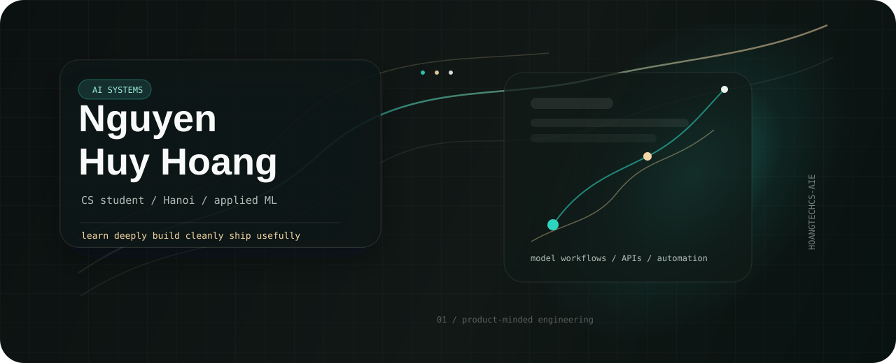

<p align="center">
  
</p>

<table>
  <tr>
    <td width="58%" valign="top">
      <h2>Building practical AI systems with a product spine.</h2>
      <p>
        I am Nguyen Huy Hoang, a Computer Science student at Hanoi University of Industry,
        based in Hanoi, Vietnam. My work sits between applied machine learning, backend
        engineering, automation, and the habit of turning rough technical ideas into usable
        software.
      </p>
      <p>
        I care about systems that are measurable, explainable, and useful outside the notebook:
        model workflows, clean APIs, intelligent assistants, and data-driven products.
      </p>
    </td>
    <td width="42%" valign="top">
      <h3>Current Direction</h3>
      <code>AI Engineering</code><br />
      <code>Machine Learning</code><br />
      <code>Backend Systems</code><br />
      <code>Product Development</code>
      <br /><br />
      <a href="https://fb.com/htech.aie"></a>
      <a href="https://instagram.com/htechcs_aie"></a>
      <a href="https://codeforces.com/profile/incomprehensibilities"></a>
      <a href="https://www.leetcode.com/hoangtechcs-aie"></a>
    </td>
  </tr>
</table>

## Operating System

| Track | What I am sharpening |
| --- | --- |
| Applied AI | PyTorch workflows, model training, intelligent automation, AI assistants |
| Backend | Clean APIs, reliable services, data processing, production-aware structure |
| Algorithms | Competitive programming discipline through Codeforces and LeetCode |
| Product | Translating technical ideas into tools people can understand and use |

## Tool Palette

<p>
  
  
  
  
  
  
  
  
  
  
</p>

## Studio Notes

```text
2026 focus       : applied AI foundations, backend craft, stronger CS fundamentals
working rhythm   : learn deeply, build consistently, document clearly
long-term aim    : senior AI engineer -> technical founder
design instinct  : quiet systems, sharp hierarchy, useful products
```

## GitHub Signal

<p>
  
  
</p>

<p>
  
</p>

<sub>
  Built as a small digital atelier: fewer generic blocks, more signal, more structure.
</sub>
