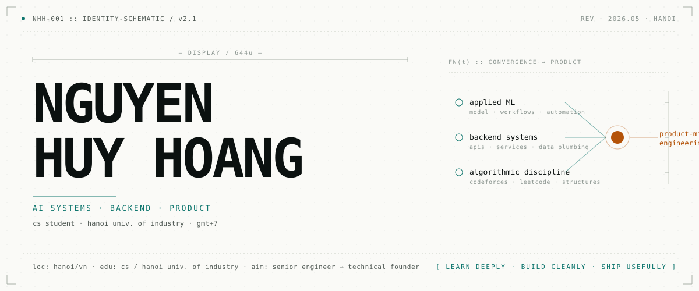
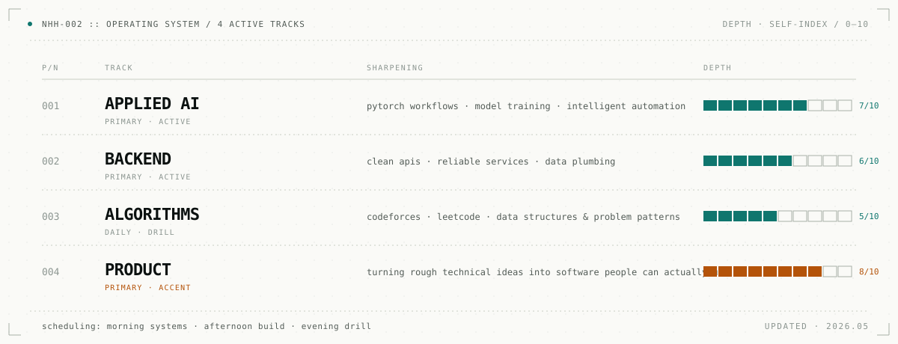
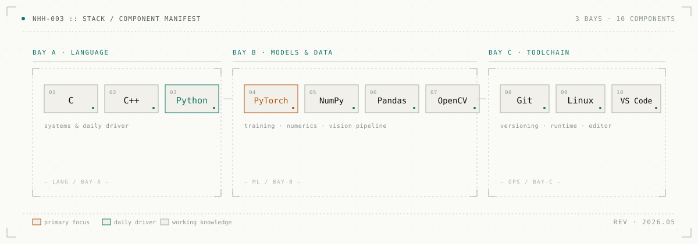
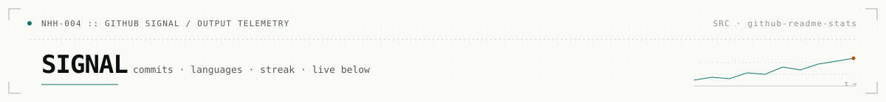
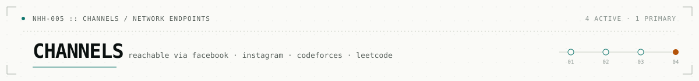
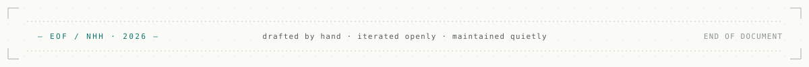

<!--
  NHH :: github profile readme · schematic blueprint
  ----------------------------------------------------
  rendered as 5 stacked schematic plates from ./assets.
  each block ships in two palettes; <picture> swaps them
  based on the visitor's github theme preference.

    dark palette  : bg #0B1110, ink #9CE7DA / #F3D7A6
    light palette : bg #FAFAF7, ink #0F766E / #B45309
-->

<picture>
  <source media="(prefers-color-scheme: dark)" srcset="./assets/01-identity.svg" />
  
</picture>

<picture>
  <source media="(prefers-color-scheme: dark)" srcset="./assets/02-operating-system.svg" />
  
</picture>

<picture>
  <source media="(prefers-color-scheme: dark)" srcset="./assets/03-stack.svg" />
  
</picture>

<picture>
  <source media="(prefers-color-scheme: dark)" srcset="./assets/04-signal-header.svg" />
  
</picture>

  <picture>
    <source media="(prefers-color-scheme: dark)" srcset="https://github-readme-stats.vercel.app/api?username=HoangTechCS-AIE&show_icons=true&hide_border=true&rank_icon=github&bg_color=0B1110&title_color=9CE7DA&text_color=DDE7DF&icon_color=F3D7A6" />
    
  </picture>
  <picture>
    <source media="(prefers-color-scheme: dark)" srcset="https://github-readme-stats.vercel.app/api/top-langs/?username=HoangTechCS-AIE&layout=compact&hide_border=true&bg_color=0B1110&title_color=9CE7DA&text_color=DDE7DF" />
    
  </picture>

  <picture>
    <source media="(prefers-color-scheme: dark)" srcset="https://github-readme-streak-stats.herokuapp.com?user=HoangTechCS-AIE&hide_border=true&background=0B1110&ring=9CE7DA&fire=F3D7A6&currStreakLabel=9CE7DA&sideLabels=DDE7DF&currStreakNum=DDE7DF&sideNums=DDE7DF&dates=AEBBB5" />
    
  </picture>

<picture>
  <source media="(prefers-color-scheme: dark)" srcset="./assets/05-channels-header.svg" />
  
</picture>

  <a href="https://fb.com/htech.aie">
    <picture>
      <source media="(prefers-color-scheme: dark)" srcset="https://img.shields.io/badge/01_·_facebook-0B1110?style=for-the-badge&logo=facebook&logoColor=9CE7DA&labelColor=0B1110" />
      
    </picture>
  </a>
  <a href="https://instagram.com/htechcs_aie">
    <picture>
      <source media="(prefers-color-scheme: dark)" srcset="https://img.shields.io/badge/02_·_instagram-0B1110?style=for-the-badge&logo=instagram&logoColor=9CE7DA&labelColor=0B1110" />
      
    </picture>
  </a>
  <a href="https://codeforces.com/profile/incomprehensibilities">
    <picture>
      <source media="(prefers-color-scheme: dark)" srcset="https://img.shields.io/badge/03_·_codeforces-0B1110?style=for-the-badge&logo=codeforces&logoColor=9CE7DA&labelColor=0B1110" />
      
    </picture>
  </a>
  <a href="https://www.leetcode.com/hoangtechcs-aie">
    <picture>
      <source media="(prefers-color-scheme: dark)" srcset="https://img.shields.io/badge/04_·_leetcode-0B1110?style=for-the-badge&logo=leetcode&logoColor=F3D7A6&labelColor=0B1110" />
      
    </picture>
  </a>

<picture>
  <source media="(prefers-color-scheme: dark)" srcset="./assets/06-eof.svg" />
  
</picture>
