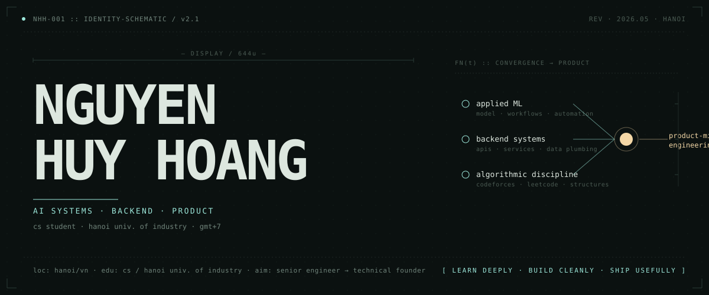
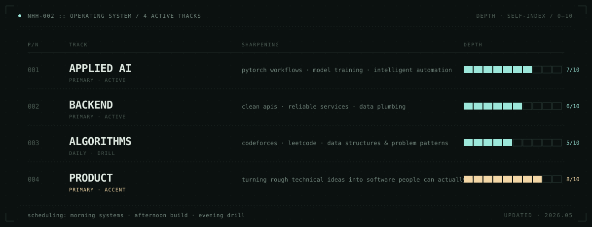
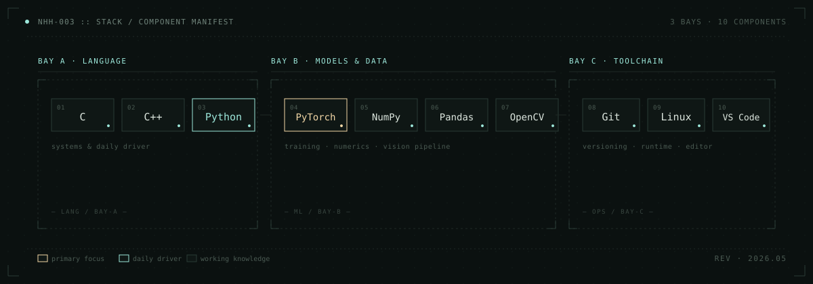
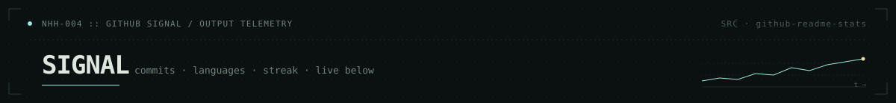
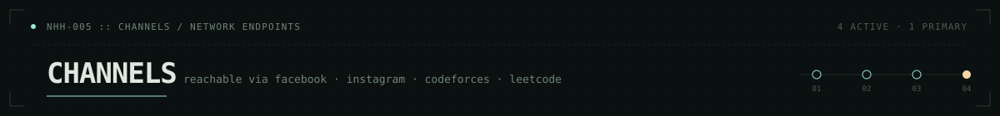
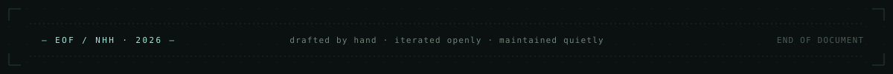

<!--
  NHH :: github profile readme · schematic blueprint
  ----------------------------------------------------
  assembled as 5 stacked schematic plates, each rendered
  from an svg in ./assets. palette is unified so external
  stat cards & shields blend into one continuous surface.
-->

  
  

  

  
  
  
  

